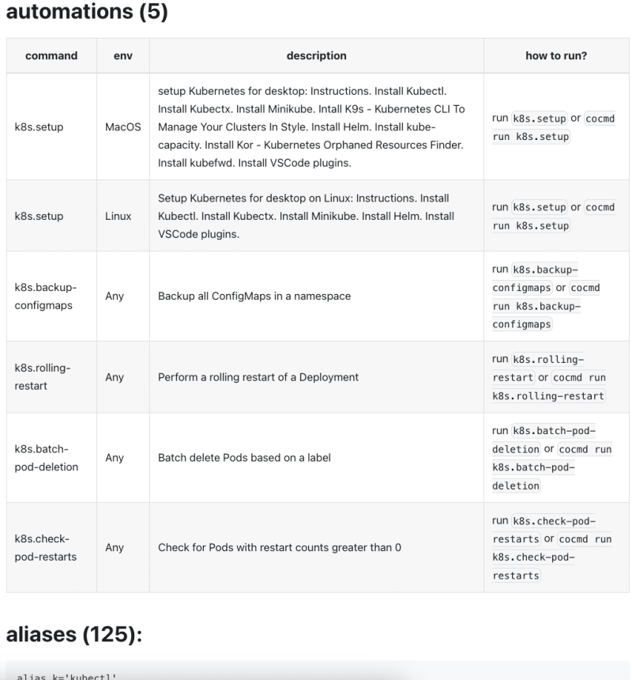

## Do you find long readmes/wikis with complicated setup instructions frustrating? 

So Do I :)

Instead of writing down long instructions with prerequisites, installation command, configuration changes and all this with operation system variations notes - let's create an amazing experience for the people who needs the software you created. No one cares about the "steps" along the way, just make it happen.

So I created **[CoCMD](https://cocmd.org)**. A simple and open cli app to make the onboarding and playbooks experience amazing.


### How does it look?

Let's take for example our [Kubernetes package](https://cocmd.org/docs/packages/from_hub/k8s/).
I created several onboarding and playbooks that can be useful.





### Showcase
It's important to talk about specific "stories" where the benefit of using CoCMD is obvious.

#### Project Onboarding

Onboarding new hires is a very important process in any company. It's the first impression that the new hire gets from the company and it's the first impression that the company gets from the new hire. It's also a very important process for the new hire to get to know the company and the people in it.

Read how to do it with CoCMD [Here](https://cocmd.org/docs/showcase/onboarding)

#### Playbooks 

Usually, every team has a set of routines and procedures that are executed on a regular basis.
This can also be called "playbooks" or "runbooks". 

CoCMD can help you automate these routines and make them available to your team.

Read how to do it with CoCMD [Here](https://cocmd.org/docs/showcase/routines)


#### Codebase CMDOps
Any project can have CMDOps (Command Line Operations). Lets say for example, your project requires some installation steps, or you want to add some shortcuts for your team or community to use.

Read how to do it with CoCMD [Here](https://cocmd.org/docs/showcase/cmdops)


### Cocmd-Hub
I created several public CoCMD Packages for Programming, Devops, Databases and general Machine setup. 
You can visit in https://cocmd.org/#hub 
or run 
```bash
cocmd install

What Packages to install?:
> [ ] zsh
  [ ] vscode
  [ ] jenkins
  [ ] impala
  [ ] git
  [ ] k8s
  [ ] python
  [ ] osx
  [ ] node
  [ ] go
  [ ] rust
  [ ] aws-s3
  [ ] docker
  [ ] prometheus
```
and get the full list

### Create your own

- add `cocmd.yaml` to your project
- follow along the guidelines https://cocmd.org/docs/packages/package-specification (still WIP)

Now your team/community can run 
```bash
cocmd install <your-repo>
``` 
and get your onboarding and playbooks.


Visit the project website on https://cocmd.org
Visit the github repo on https://github.com/cocmd

# Help wanted

https://github.com/cocmd/cocmd/issues
there are interesting issues to work on, help me :)

contact me on mzsrtgzr2@gmail.com


