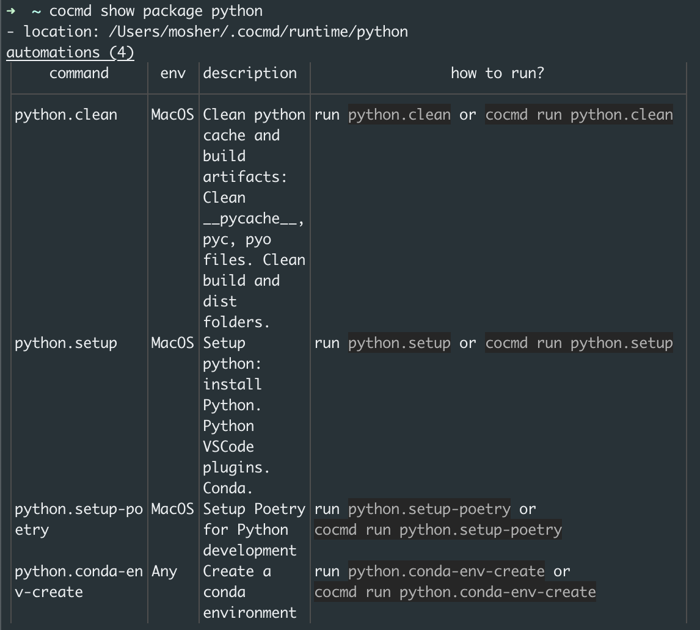

After cocmd is ready on your machine, you can start installing and running 
packages. 
Packages can be installed from any Git repository you have access to (public or private) or from Cocmd hub.

Cocmd maintains a set of public packages that you can install and use right away.

For example, if you are a Python developer, you can install and run the `python` package, the `setup` playbook:

```shell
cocmd run python.setup --from python
```


which is like running two commands:
```shell
cocmd install python
cocmd run python.setup
```

now you should see the `python` package installed:

```shell
cocmd show package python
```



This means that we can run `python.setup` (after opening new terminal) or with `cocmd run python.setup` to install Python on our machine:

